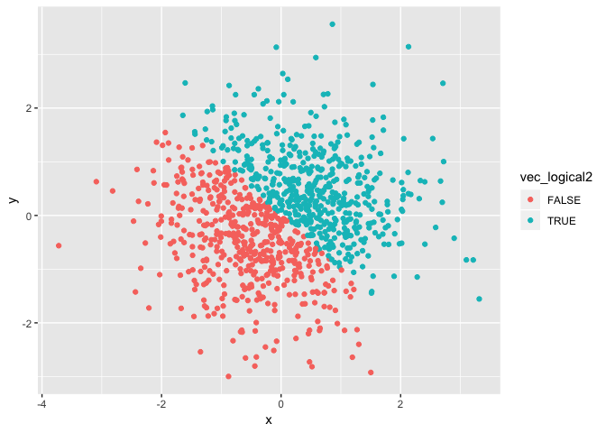
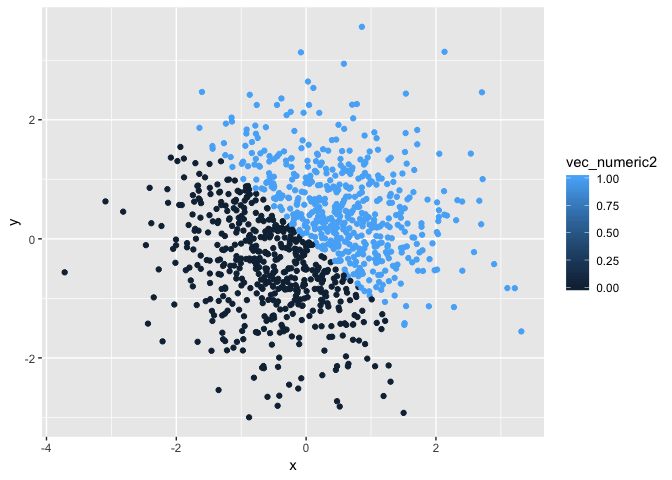
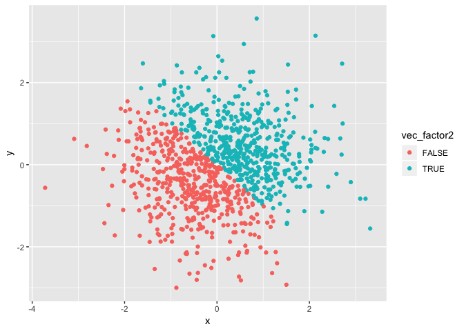

p8105\_hw1\_zf2211
================
Francis
9/21/2018

Problem 1
=========

``` r
library(tidyverse)
```

    ## ── Attaching packages ─────────────────────────────────────────────── tidyverse 1.2.1 ──

    ## ✔ ggplot2 3.0.0     ✔ purrr   0.2.5
    ## ✔ tibble  1.4.2     ✔ dplyr   0.7.6
    ## ✔ tidyr   0.8.1     ✔ stringr 1.3.1
    ## ✔ readr   1.1.1     ✔ forcats 0.3.0

    ## ── Conflicts ────────────────────────────────────────────────── tidyverse_conflicts() ──
    ## ✖ dplyr::filter() masks stats::filter()
    ## ✖ dplyr::lag()    masks stats::lag()

``` r
sed.seed = 777
rs = runif(10, 0, 5)
df = tibble(
  rs,
  vec_logical = rs>2,
  vec_character = c("usa", "canada", "france", "england", "japan", "sweden", "korea", "germany", "italy", "austria"),
  vec_factor = c("M", "M", "M", "F", "M", "F", "M", "F", "M", "F")
)
```

Print df

``` r
df
```

    ## # A tibble: 10 x 4
    ##       rs vec_logical vec_character vec_factor
    ##    <dbl> <lgl>       <chr>         <chr>     
    ##  1 1.41  FALSE       usa           M         
    ##  2 1.45  FALSE       canada        M         
    ##  3 4.85  TRUE        france        M         
    ##  4 1.72  FALSE       england       F         
    ##  5 2.67  TRUE        japan         M         
    ##  6 2.93  TRUE        sweden        F         
    ##  7 2.11  TRUE        korea         M         
    ##  8 4.60  TRUE        germany       F         
    ##  9 0.449 FALSE       italy         M         
    ## 10 4.29  TRUE        austria       F

Mean of variables in dataframe

``` r
mean(df$rs)
```

    ## [1] 2.647319

``` r
mean(df$vec_logical)
```

    ## [1] 0.6

``` r
mean(df$vec_character)
```

    ## Warning in mean.default(df$vec_character): argument is not numeric or
    ## logical: returning NA

    ## [1] NA

``` r
mean(df$vec_factor)
```

    ## Warning in mean.default(df$vec_factor): argument is not numeric or logical:
    ## returning NA

    ## [1] NA

We can calculate numeric and logical vectors' means because the logical vector "FALSE" and "TRUE" was transformed into numeric 0 and 1. Since character and factor variables could not be transformed, their means could not be calculated.

``` r
as.numeric(df$vec_logical)
```

    ##  [1] 0 0 1 0 1 1 1 1 0 1

``` r
as.numeric(df$vec_character)
```

    ## Warning: NAs introduced by coercion

    ##  [1] NA NA NA NA NA NA NA NA NA NA

``` r
as.numeric(df$vec_factor)
```

    ## Warning: NAs introduced by coercion

    ##  [1] NA NA NA NA NA NA NA NA NA NA

It shows logical "TRUE" and "FALSE" could be converted into numeric 1 and 0, while character and factor variables could not be converted (respectively replaced by "NA" after coercion).

``` r
as.numeric(
  as.factor(df$vec_character)
)
```

    ##  [1] 10  2  4  3  7  9  8  5  6  1

``` r
as.numeric(
  as.character(df$vec_factor)
)
```

    ## Warning: NAs introduced by coercion

    ##  [1] NA NA NA NA NA NA NA NA NA NA

If I convert character to factor then numeric, it will work. It seems those characters refer to data in some database? While converting factor to character then numeric doesn't work (respectively replaced by "NA" after coercion).

Problem 2
=========

``` r
set.seed(777)

x = rnorm(1000)
y = rnorm(1000)
vec_logical2 = x + y > 0
vec_numeric2 = as.numeric(vec_logical2)
vec_factor2 = as.factor(vec_logical2)

df2 = tibble(x, y, vec_logical2, vec_numeric2, vec_factor2)

df2
```

    ## # A tibble: 1,000 x 5
    ##         x       y vec_logical2 vec_numeric2 vec_factor2
    ##     <dbl>   <dbl> <lgl>               <dbl> <fct>      
    ##  1  0.490 -0.374  TRUE                    1 TRUE       
    ##  2 -0.399 -0.306  FALSE                   0 FALSE      
    ##  3  0.511  0.312  TRUE                    1 TRUE       
    ##  4 -0.399 -1.19   FALSE                   0 FALSE      
    ##  5  1.64   0.0243 TRUE                    1 TRUE       
    ##  6  0.621  0.104  TRUE                    1 TRUE       
    ##  7  0.203  2.12   TRUE                    1 TRUE       
    ##  8  1.11   1.06   TRUE                    1 TRUE       
    ##  9 -0.206 -1.26   FALSE                   0 FALSE      
    ## 10 -0.379 -1.44   FALSE                   0 FALSE      
    ## # ... with 990 more rows

The size of the dataset is 1000 rows \* 5 columes. The mean and median of x is 0.0019766 and -0.0187056. The proportion of cases for which the logical vector is TRUE is 0.502).

``` r
library(ggplot2)
ggplot(df2, aes(x = x, y = y, color = vec_logical2)) + geom_point()
```



``` r
ggsave("df2.pdf", height = 5, width = 7 )
###save the graph as df2.pdf, let the height be 5, width be 7.
ggplot(df2, aes(x = x, y = y, color = vec_numeric2)) + geom_point()
```



``` r
ggplot(df2, aes(x = x, y = y, color = vec_factor2)) + geom_point()
```



From the color scales we can see that the color of the dots in first(logical vector) and third(factor vector) is bipolar, while the second(numeric vector) is gradual.
